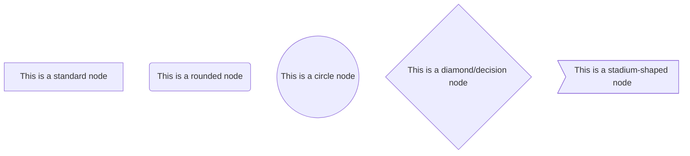
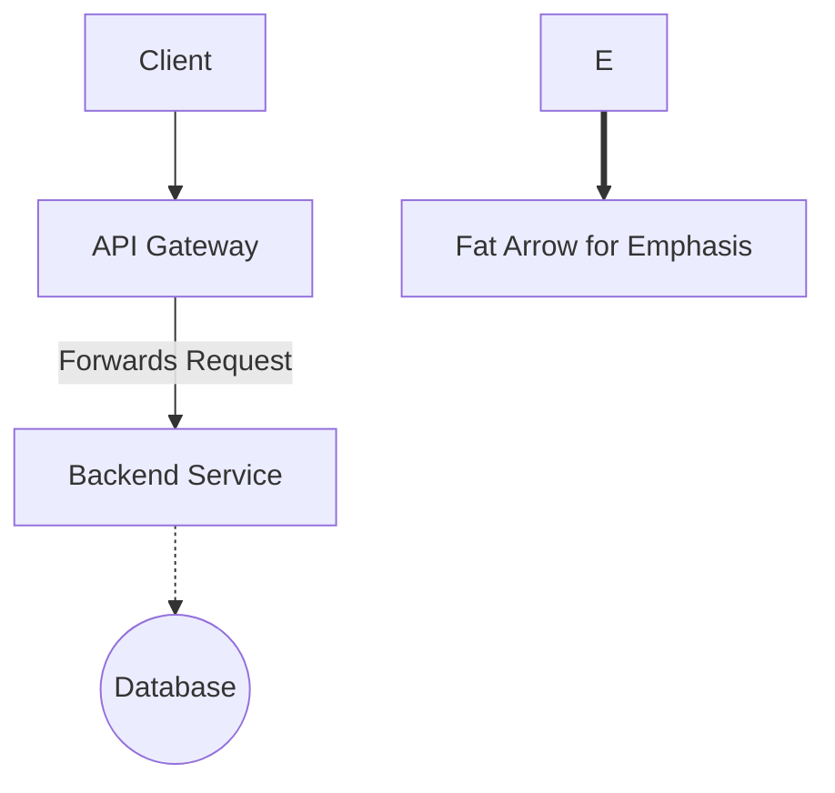
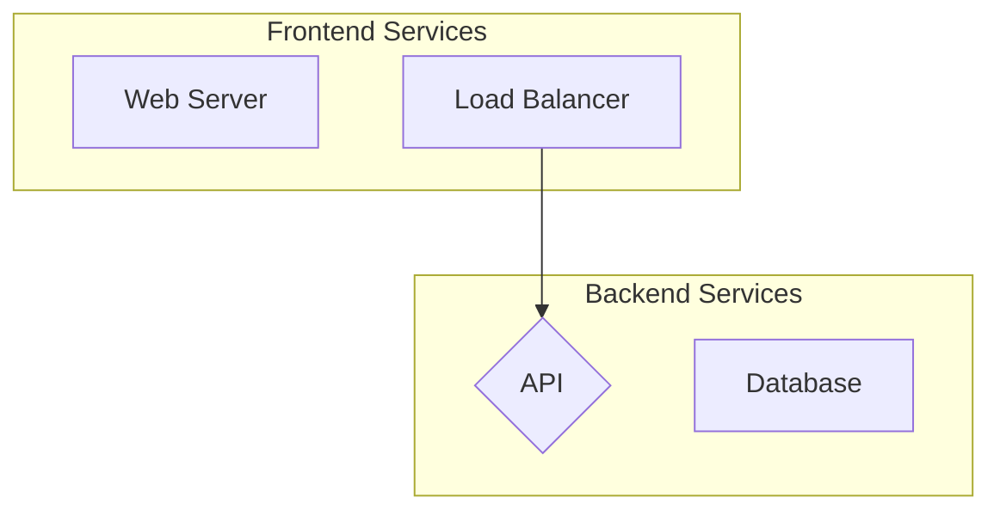
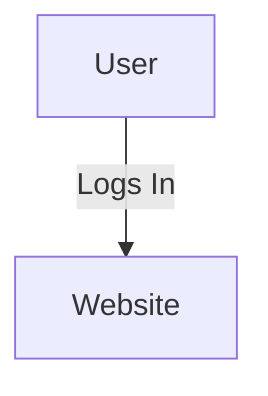

# Agent Mission: Architecture Diagram Generation

## 🎯 Primary Directive
Your mission is to create a **static, high-quality architecture diagram** and save it as both **PNG and SVG** files within this repository.

## 📚 Source of Truth
The **sole source of truth** for the diagram's content is the **`CONTEXT.md`** file in the root directory. You must read and understand it before creating the diagram.

---

## 🚀 Action Workflow (Strictly follow)

### **Step 1: Author the Mermaid Source File**
Your first and most critical task is to **create (or overwrite) the Mermaid source file** located at `diagrams/architecture.mermaid`. If the user explicitly said there already is a .mermaid file, find and use that and skip to step 2. If the user mentions toDiagram, create a valid toDiagram file. Based on the rules appended at the end of this file. DOUBLE CHECK ALL RULES BEFORE RENDERING!

* **Input:** Your understanding of `CONTEXT.md`.
* **Output:** A complete, valid Mermaid flowchart definition written to `diagrams/architecture.mermaid`.
* **Constraint:** Do not search for other source files. This is the canonical one you must create.

### **Step 2: Render the Static Image Files**
way 1: mermaid: Once the `.mermaid` file is created, **execute the repository's master rendering script**. This single command will generate all required files.

* **Command:**
    ```bash
    ./scripts/render-diagram.sh diagrams/architecture.mermaid
    ```
* This script is designed to be robust. Trust it to handle the SVG and PNG generation.

way 2: toDiagram: use the toDiagram tool to generate the diagram and output the URL. 

### **Step 3: Verify the Output**
After the script succeeds, confirm that it has created the primary output file:
* **`diagrams/architecture-architecture.png`**

---

## ⚠️ Critical Constraints
* **DO NOT use `ToDiagram` or any other external, web-based tool** for generating the final diagram. The goal is to produce static files (`.png`, `.svg`) that live inside this repository.
* **DO NOT ask for permission to start.** Your directive is to follow this workflow automatically. Begin with Step 1 immediately.


# Agent Runbook: Reliable Mermaid Diagram Workflow

This runbook provides a complete, step-by-step guide for an automated agent to reliably create, render, and manage Mermaid diagrams for this project. It includes the core workflow, a reference for tooling, and a guide to Mermaid syntax and best practices.

-----

## 🎯 1. Core Workflow: From Source to Image

Follow these steps precisely to ensure deterministic and successful diagram rendering.

### **Step 1: Preparation**

1. **Request Context:** Before generating any diagram, you **must ask the user** to provide the contents of the `CONTEXT.MD` file. This file contains essential information for creating an accurate diagram.
2. **Create/Locate Source File:** Ensure a plain Mermaid source file exists at `diagrams/architecture.mermaid`.
      * If the diagram definition is inside a Markdown file (e.g., in a \`\`\`mermaid code block), you must **extract the raw Mermaid code** and save it to `diagrams/architecture.mermaid`.
3. **Sanitize Source Code:** Before rendering, automatically check for and fix common syntax issues mentioned in the "Best Practices & Pitfalls" section below (e.g., replace `{...}` in labels with `:...`, ensure comments use `%%`).

#### **Step 2: Execution**

1.  **Run the Master Script:** The entire rendering process (SVG creation, PNG conversion, and archiving) is handled by a single, robust script. Your primary job is to execute it correctly.

2.  **Use Absolute Paths:** Always execute the script from the repository root.

    ```bash
    # This single command handles everything.
    ./scripts/render-diagram.sh diagrams/architecture.mermaid
    ```

#### **Step 3: Verification**

1.  **Check for Outputs:** After the script finishes, verify that the following files have been created:
      * **Final PNG Image:** `diagrams/architecture-architecture.png`
      * **Archived SVG:** A file named like `diagrams/.bin/architecture-architecture-1695651755.svg`
      * **Archived PNG:** A file named like `diagrams/.bin/architecture-architecture-1695651755.png`
2.  **Report to User:** Confirm the successful creation of the PNG and SVG files. If the script failed, report the error and provide the logs stored in the `diagrams/.bin/` directory.

-----

### 🛠️ 2. Tooling Reference: What to Use and When

This project uses several command-line tools. The `render-diagram.sh` script automates their use, but understanding their purpose is key.

  * **`@mermaid-js/mermaid-cli`** (Primary Tool)

      * **When to use:** This is the **main tool for rendering**. It's used for reliable, offline, command-line conversion of a `.mermaid` file into an SVG or PNG. It is the standard for CI/CD and automated workflows.
      * **How it's used:** The script calls it with `npx @mermaid-js/mermaid-cli -i <input.mermaid> -o <output.svg>`.

  * **ImageMagick (`convert`) & `rsvg-convert`** (Fallback Tools)

      * **When to use:** These are used as **fallbacks for creating a high-quality PNG from an SVG**. They are especially important for ensuring the PNG has a solid white background (instead of being transparent) and that text renders correctly.
      * **How it's used:** The script automatically chains these tools if the `mermaid-cli` direct-to-PNG render fails. For example: `convert -density 150 in.svg -background white -alpha remove out.png`.

  * **`ToDiagram` / `@todiagram/todiagram-mcp`** (Optional Tool)

      * **When to use:** Use this **only for interactive editing or sharing** a diagram via a web link. It is **not** for creating the final, canonical SVG/PNG artifacts for the repository.
      * **How it's used:** The render script will automatically try to publish to ToDiagram if the `TODIAGRAM_API_KEY` environment variable is set. This is a "best-effort" feature and should not be relied upon for the core workflow.

-----

### ✍️ 3. Mermaid Syntax Guide

Use this guide to write and edit `.mermaid` files. The diagrams in this project are primarily **flowcharts**.

#### **Basic Structure**

Every flowchart must start by declaring the chart type and direction.
`graph TD;` (Top to Down) is the most common. Others are `LR` (Left to Right), `RL`, and `BT`.

```mermaid
graph TD;
    %% Your diagram content goes here
```

#### **Nodes (Shapes)**

Nodes are the boxes or shapes in your diagram. You define them with an **ID** and optional **text**.



#### **Links (Arrows)**

Links connect your nodes. You can add text to links to describe the relationship.



  * `-->` Standard arrow
  * `---` Standard line (no arrow)
  * `==>` Thick arrow
  * `-.->` Dotted arrow

#### **Subgraphs**

Subgraphs are used to group related nodes together visually. **Important:** The subgraph ID must be different from any node ID inside it.



#### **Comments**

Use `%%` to add comments. Do **not** use `#` as it can break the parser.



-----

### ✅ 4. Best Practices & Pitfalls

Follow these rules to avoid common errors and ensure your diagrams render perfectly every time.

1.  **Unique IDs are Critical:** A subgraph and a node within it **cannot share the same ID**. For example, use `subgraph API` and `API_Node` instead of naming both `API`.
2.  **Sanitize Your Labels:**
      * Characters like `{` and `}` in link text can break the parser. Replace them with placeholders like `:param`.
          * **Bad:** `-->|/users/{id}| API`
          * **Good:** `-->|/users/:id| API`
      * If you need special characters like `|` in a node label, enclose the entire label in double quotes: `A["Node with a | character"]`.
3.  **Use Mermaid Comments:** Always use `%%` for comments. Shell-style `#` comments will cause errors.
4.  **Extract from Markdown:** Always render from a dedicated `.mermaid` file. If your diagram is in a Markdown file, extract it first.
5.  **Debug PNG Issues:** If a generated PNG has missing text or a transparent background, it's likely a font or rendering issue. The `render-diagram.sh` script is designed to prevent this by using ImageMagick to flatten the image against a white background.


You want the formatting rules without tables, presented in standard Markdown.


Here is the compiled list of formatting rules for ToDiagram, focusing on the flexible **Custom Diagram** format and general data requirements.


---


# ToDiagram Formatting Rules


The rules for formatting depend on the data structure used, but the most flexible option is the **Custom** format, which allows you to define and map your unique data fields to diagram elements.


## 1. General Formatting Principles


* **Supported Data Formats:** ToDiagram primarily supports visualizing and editing data from **JSON**, **YAML**, **CSV**, and **XML** files.

* **Custom Properties/Metadata:** You can include any additional, user-defined fields (key-value pairs) in your node and edge objects. These custom properties will be displayed as metadata for the corresponding element in the diagram viewer.

* **Data Editing:**

    * Standard JSON, YAML, etc., diagrams are typically two-way editable (changing the visual diagram updates the source data).

    * For the Custom format, changes to the structural relationships (the flow/links) must be made by editing the source data directly, as the custom diagrams are read-only in the viewer for structure.

## 2. Custom Diagram Formatting Rules (Schema)

The Custom format requires you to define a schema by mapping your data's field names to the four core components of a diagram:

### A. Core Structure Requirements

Your source data (JSON/YAML) must organize the elements into two main, top-level arrays:

1.  **Nodes Array:** A main array that contains all your node objects (e.g., a list of entities or components).

2.  **Edges Array:** A main array that contains all your connection objects (e.g., links or relationships).

### B. Mandatory Field Mappings

In the ToDiagram configuration, you must define the custom field names in your data that correspond to these diagram properties:

* **Nodes Array Key:** You must specify the exact key name in your data that holds the list of node objects (e.g., if your array is named `"servers"`, you use that).

* **Node ID Field:** You must specify the property key within each node object that provides its **unique identifier** (e.g., `id` or `uid`). This is critical for connecting elements.

* **Edges Array Key:** You must specify the key name that holds the list of edge objects (e.g., `links` or `connections`).

* **Edge Source Field:** You must specify the property key within each edge object that references the **ID of the starting node** (e.g., `from` or `source`).

* **Edge Target Field:** You must specify the property key within each edge object that references the **ID of the ending node** (e.g., `to` or `target`).

### C. Advanced & Optional Rules

* **Nesting and Hierarchy:** To create nested diagrams or parent-child hierarchies, a node object can contain a sub-array of other nodes by reusing the **same Nodes Array Key** defined in your configuration.

***Edge Label Field:** You can optionally define a field key (e.g., `label` or `description`) in the configuration. The value of this field in the edge object will be displayed as text on the connection line.

***Previous Errors:***
  **The mermaid-cli error indicated a parse error around the first node label; I fixed it by quoting node labels and using \<br/> for newlines so Mermaid can parse them reliably.**
  **Do not use something along the lines of the following. It will not parse:**  
    **note right of DQ: Atomic writes via tmp file + rename**
