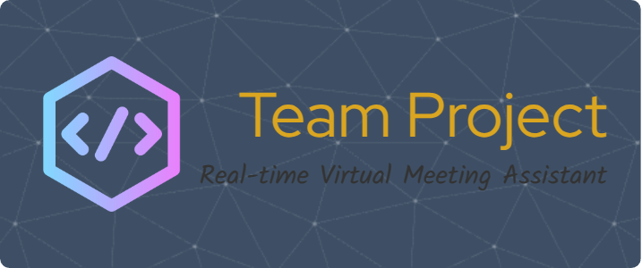

# 💡 Real-time Contextual Assistant
<p align="center">
  
</p>

<p align="center">
  <strong>Ein KI-gestützter Desktop-Assistent, der in Echtzeit kontextbezogene Erklärungen während Live-Gesprächen liefert.</strong>
  <br />
</p>

<p align="center">
  
  
</p>

---

## 📋 Inhaltsverzeichnis

1.  [🌟 Über das Projekt](#-über-das-projekt)
2.  [🛠️ Tech-Stack](#-tech-stack)
3.  [🏛️ Architektur](#-architektur)
4.  [🚀 Erste Schritte](#-erste-schritte)
    * [Voraussetzungen](#voraussetzungen)
    * [Installation & Setup](#installation--setup)
    * [Anwendung starten](#anwendung-starten)

---

## 🌟 Über das Projekt

Willkommen beim **Real-time Contextual Assistant**! Dieses Projekt ist eine eigenständige Desktop-Anwendung, die entwickelt wurde, um virtuelle Meetings, Vorlesungen und Präsentationen zu verbessern. Sie hört aktiv bei Gesprächen zu und liefert den Benutzern sofortige, kontextbezogene Informationen. Wenn beispielsweise ein komplexer Fachbegriff erwähnt wird, zeigt der Assistent sofort eine prägnante Erklärung an, sodass die Teilnehmer dem Gespräch ohne Unterbrechung folgen können.

Diese Echtzeitfähigkeit ist der Kern unserer Innovation und nutzt eine moderne, serviceorientierte Architektur, um Funktionen bereitzustellen, die selbst von führenden Plattformen noch nicht vollständig unterstützt werden.

---

## 🛠️ Tech-Stack

Unser System basiert auf einem modernen, asynchronen Stack, der für hochleistungsfähige Echtzeit-KI-Verarbeitung ausgelegt ist.

| Kategorie | Technologien |
| :--- | :--- |
| **Frontend** |    |
| **Backend** |   |
| **KI & Sprache** |    |
| **Echtzeit-Kommunikation** |  |

---

## 🏛️ Architektur

Die Anwendung besteht aus einer Sammlung unabhängiger Dienste, die in Echtzeit kommunizieren. Dieses entkoppelte Design gewährleistet Stabilität und Skalierbarkeit.


Die Hauptkomponenten sind:
1.  **System Runner:** Ein Master-Skript, das alle anderen Dienste startet, überwacht und herunterfährt.
2.  **STT-Modul:** Ein dedizierter Prozess zur Erfassung von Mikrofon-Audio und zur Durchführung einer hochleistungsfähigen Speech-to-Text-Umwandlung.
3.  **Backend (FastAPI):** Der zentrale Hub, der Clients verwaltet, Nachrichten weiterleitet und die KI-Pipeline orchestriert.
4.  **Frontend (Electron):** Die benutzerseitige Desktop-Anwendung, die die Echtzeitinformationen anzeigt.

> Für einen tiefen Einblick in unsere technische Implementierung lesen Sie bitte unser detailliertes **[Architektur-Dokument](./docs/ARCHITECTURE.md)**.

---

## 🚀 Erste Schritte

Befolgen Sie diese Schritte, um das Projekt lokal einzurichten und auszuführen.

### Voraussetzungen
* Python 3.10+
* Node.js 18+ und `npm`
* [Ollama](https://ollama.com/) muss auf Ihrem lokalen Rechner installiert sein und laufen.

### Installation & Setup

1.  **Repository klonen:**
    ```bash
    git clone [https://github.com/your-repo/your-project.git](https://github.com/your-repo/your-project.git)
    cd your-project
    ```

2.  **Backend einrichten (Python):**
    ```bash
    # Eine virtuelle Umgebung erstellen und aktivieren
    python3 -m venv .venv
    source .venv/bin/activate
    
    # Python-Abhängigkeiten aus dem Stammverzeichnis installieren
    pip install -r requirements.txt
    ```

3.  **Frontend einrichten (Node.js):**
    ```bash
    # In das Frontend-Verzeichnis wechseln
    cd Frontend
    
    # Node.js-Abhängigkeiten installieren
    npm install
    cd .. 
    ```

4.  **KI-Modell einrichten (Ollama):**
    Laden Sie das erforderliche LLM herunter. Wir verwenden derzeit `llama3.2`.
    ```bash
    ollama pull llama3.2
    ```

### Anwendung starten

Starten Sie das gesamte System mit dem Haupt-Runner-Skript aus dem **Stammverzeichnis** des Projekts:
```bash
python main.py
Das Skript startet das Backend, das STT-Modul und die Electron-Anwendung.
